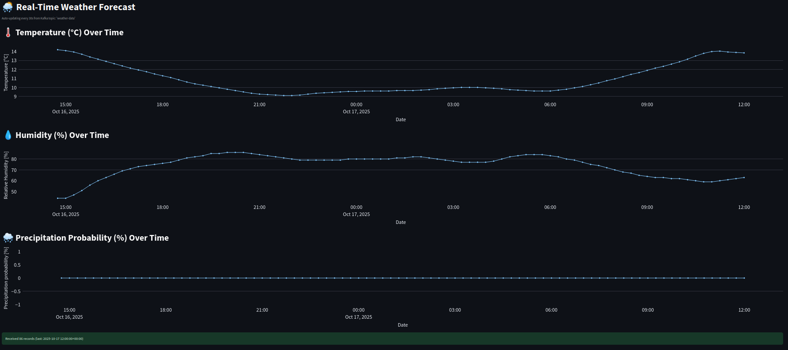

# Real-time weather stream
Real-time weather data pipeline built with Docker, Apache Kafka, Open-Meteo API, and Streamlit.

## Features

- This project uses Docker to handle and deploy Kafka in a container.
- The Kafka producer regularly fetches and publishes the weather forecast on your estimated location (based on your IP address).
- The Kafka consumer is a Streamlit dashboard that reads the messages from the producer and visualizes them on an interactive real-time dashboard, showing the weather forecast for the upcoming 24 hours.

## Requirements
- Python -- version 3.8.10
- virtualenv -- version 20.0.17
- Docker -- version 28.1.1, build 4eba377

## Installation
Clone the repository into your working directory
```bash
git clone https://github.com/beltran99/weather-stream.git
```

Navigate to the project folder
```bash
cd weather-stream
```

Install virtualenv if you don't have it installed already
```bash
pip install virtualenv
```

Create a new virtual environment
```bash
virtualenv venv
```

Activate the virtual environment
```bash
source venv/bin/activate
```

Installed the required packages in the virtual environment
```bash
pip install -r requirements.txt
```

## Setting up
Setup the docker container
```bash
docker compose up -d
```

Create the Kafka topic inside the docker container for the weather stream
```bash
docker exec -it kafka /opt/kafka/bin/kafka-topics.sh --bootstrap-server localhost:9092 --create --topic weather-data --partitions 1 --replication-factor 1
```

Check that the Kafka topic has been correctly created
```bash
docker exec -it kafka /opt/kafka/bin/kafka-topics.sh --bootstrap-server localhost:9092 --list
```

Run the Kafka producer in the background
```bash
python3 -m weather-stream.producer &
```

Run the Streamlit server and show the live dashboard
```bash
streamlit run weather-stream/dashboard.py
```

## Dashboard
